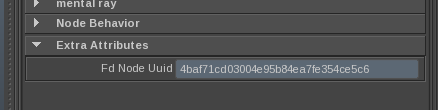

# Muuid 1.0

## About

Muuid (pronounce _"mee-youd"_) is a simple way to handle UUIDs on Maya nodes.

It expose few simple method to add, find, and check UUID on current scene nodes.
UUIDs are stored in node attributes and are often used to track shapes.

## Features

* Low fooprint (Averagely 152 bytes by node in .ma and 128 bytes by node in .mb)
* Module can be customized depending on your needs:
  * UUID attribute name on Maya nodes.
  * List of node type you want to put a UUIDs on.
* Write with KiSS principle.

## Configure

Before jump and use Muuid in any scene, you need to set few variables to adapt
on your workflow. Few variables can be redefined in config.py:

* `UUID_ATTR_NAME` : The name of the attribute that will be created on each node
and that will contain the UUID.
* `TRACKABLE_NODE_TYPES` : A list on node type you want to put a UUID on.

## Examples

Set a UUID to every node in your scene :

    >>> import muuid
    >>> muuid.set_all_uuids()

Set a UUID on one specific node :

    >>> import muuid
    >>> muuid.set_uuid( node )

Check everything related to UUIDs is valid in the current scene (This is the
first thing to do if you want to use muuid on a scene). This ensure every node
has a valid UUID :

    >>> import muuid
    >>> muuid.check_uuids()
    True

Get the node with the given UUID :

    >>> import muuid
    >>> muuid.get_node( '19e1f2935ac547d08891cbee179c00ef' )
    '|group1|group2'

Get the UUID of the given node :

    >>> import muuid
    >>> muuid.get_uuid( '|group1|group2' )
    '19e1f2935ac547d08891cbee179c00ef'

Get a dict with UUIDs as key and full node path as value :

    >>> import muuid
    >>> muuid.uuid_map()
    {u'19e1f2935ac547d08891cbee179c00ef': u'|group1|group2',
     u'3073c0da57d747cbb77b0c290b805c97': u'|toto:pSphere3',
     u'6475e1f84465491ab57972e0883df8a3': u'|toto:pSphere4',
     u'63547c2a454545958d589e4d7a38d727': u'|toto:pSphere5',
     u'6ab75d02bb044c6183b87615a450fd95': u'|group1|group2|fooNamespace:group4|pSphere5',
     u'f948a707e0d74bbebe94c942f41b2742': u'|group1'}

## References

* [Maya 2014 documentation](http://download.autodesk.com/global/docs/maya2014/en_us/index.html)
* [Python UUID module documentation](http://docs.python.org/2.7/library/uuid.html)

